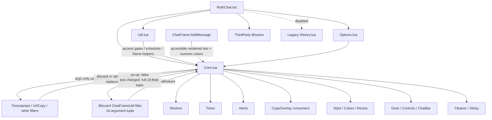

# Roth Chat code graph

The filter path and post-render `AddMessage` path are separate trust boundaries. No-op filters leave Blizzard's current secure tuple in place; a changed `arg1` is returned with all remaining fields preserved. Raw filter tuples and trailing opaque render metadata must not enter module state or SavedVariables.
