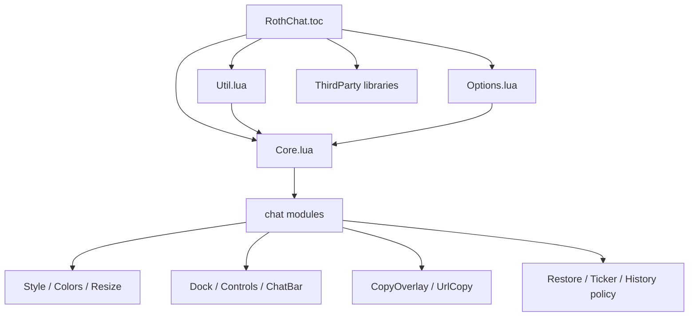

# Roth Chat code graph

```mermaid
flowchart TD
  T["RothChat.toc"] --> U["Util.lua"]
  T --> C["Core.lua"]
  U --> C
  C --> M["chat modules"]
  M --> S["Style / Colors / Resize"]
  M --> I["Dock / Controls / ChatBar"]
  M --> X["CopyOverlay / UrlCopy"]
  M --> R["Restore / Ticker / History policy"]
  T --> O["Options.lua"]
  O --> C
  T --> L["ThirdParty libraries"]
```
